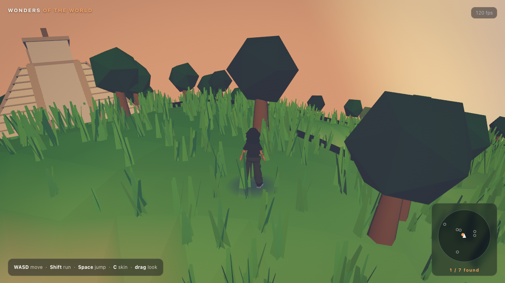
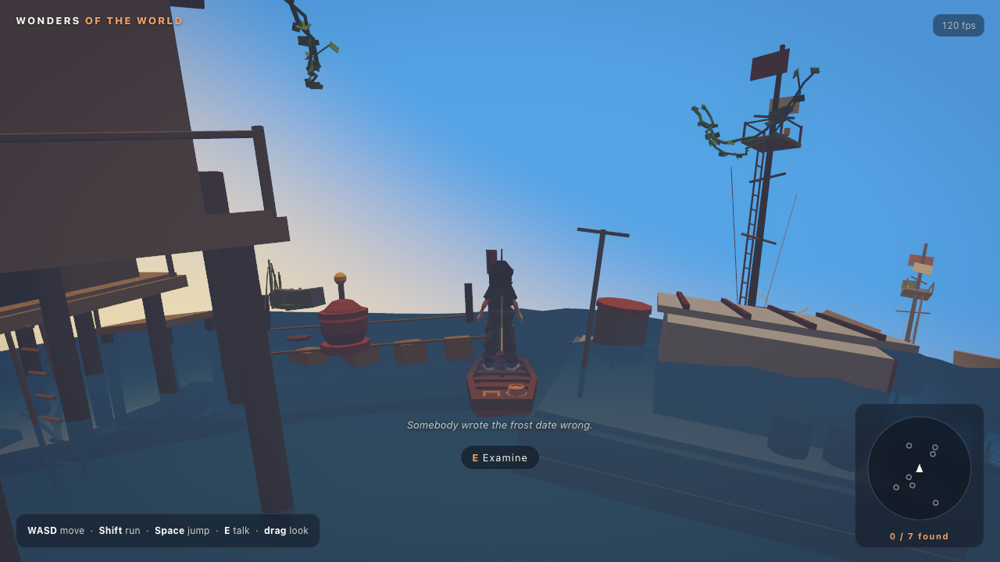
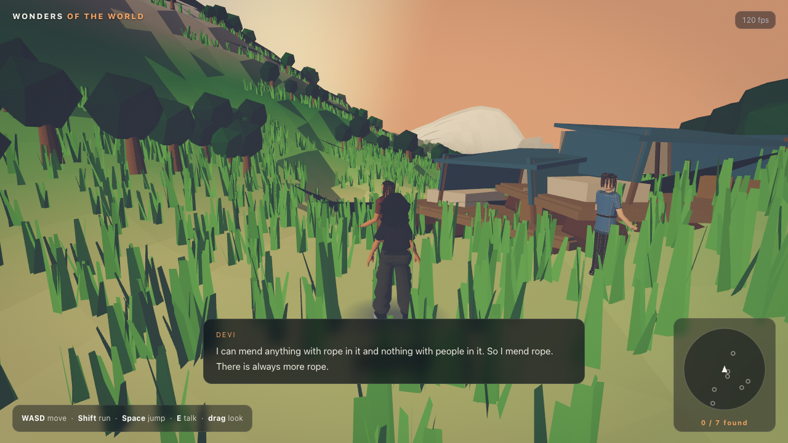

# Wonders — A Tiny Planet

An explorable planet built with [Three.js](https://threejs.org/) and [three-mesh-bvh](https://github.com/gkjohnson/three-mesh-bvh), inspired by [Messenger](https://messenger.abeto.co/) by Studio Abeto.

The sea has been rising for six generations. Walk a procedurally generated world, sail its oceans, meet the people still living on it, and piece together what happened — all toon-shaded, running in a browser tab.


*Chichen Itza on a terraced hilltop — instanced grass and trees with wind, the player-centred minimap, and the day cycle low in the sky.*


*Step onto water and you board a boat automatically. The sea is deliberately oversized — crests run about two player-heights and wash over the shoreline.*


*Press E to talk. Every line is written to its speaker's age, their settlement, and how much of the story you have uncovered.*

## Features

**Story**
- The world is drowning, and elevation tells the story: ruins at the waterline the sea already took, stilt houses where the stubborn still bail every day, and the living retreated uphill. The full premise, tone and cast are in [docs/STORY.md](docs/STORY.md).
- ~2,000 written lines of dialogue and environmental lore. Each is tagged with a voice (child, teen, adult, elder), a settlement band, and a story stage.
- **Five stages of revelation, gated by exploration** rather than by talking. Stage 0 is weather and work with no mention of the flood; stage 4 is what people do with an ending. The story deepens because you went somewhere.
- Children have never seen the water lower, so to them the flood is not a tragedy — it is simply the world. Adults deflect grief into logistics. Elders reveal enormous things while complaining about something trivial.
- The seven wonders are all misremembered, each in a way that reveals something: Giza as deliberate flood markers, the Great Wall as a failed dam whose breach pilgrims still search for, the Colosseum as a cistern where lions drank.
- NPCs murmur ambient lines as you pass and give longer beats on `E`. Each remembers what they have already told you.
- Places can be examined too, and say more as the story unlocks.

**World**
- Procedurally generated planet of radius 150 — a continent mask gives coherent landmasses with real coastlines, ridged multifractal noise builds continuous mountain ranges, terraced bands form mesas, and inverted-ridge channels carve valleys down to the sea. Roughly 32% land, peaks to 67 units, every page load a new world.
- Coastlines are deliberately walkable: a wide shallow shelf means you can wade ashore without jumping (measured 100% of attempts), while mountains stay dramatic and climbable on foot.
- ~21 settlements built from 28 hand-modelled structures, placed by elevation band — drowned ruins, stilt clusters and rafts, shanties, upland yurts and terraces, mountain camps, cave dwellings.
- Up to 60 residents drawn from 15 characters, cast by band and age. Their animation is chosen to match: bailing and hauling at the waterline, shivering and resting up the mountain, kid clips for the children.
- Seven wonder monuments (`.glb`) placed on a spherical Fibonacci lattice, with a site search that scores candidate ground for flatness and dryness before committing.
- Level terraces are carved under each monument so flat-based buildings seat flush against curved, noisy terrain.
- Toon shading throughout — a shared 4-band gradient map, vertex colours, inverted-hull outlines, no textures anywhere.

**Life and atmosphere**
- 90,000 instanced grass tufts and 2,400 trees, scattered by sampling the real terrain mesh after terracing and split into chunks so most of them cull.
- Wind as a vertex-shader injection into the existing toon material: per-instance flutter plus a slow travelling gust envelope, so gusts roll across the field. Zero per-frame CPU cost.
- Day cycle — the sun arcs from early morning through midday to afternoon and loops, never dipping below the horizon. Light colour, intensity, sky gradient and fog all key off sun elevation. Currently pinned to a high sun (`PINNED_PHASE` in `render/daylight.ts`).
- Ocean waves: a heavy swell with chop and turbulence on top, and water that is clear enough overhead to read a drowned settlement through but seals up toward the horizon, so you cannot see across the planet.
- Post-processing in a single fullscreen pass: anime diffusion glow, ACES tone mapping, colour grading, vignette, dither and sRGB conversion.

**Movement**
- Tangent-plane movement on the sphere, with gravity, jumping, slope limits and step-up.
- Collision against the monuments' real geometry — you can walk into the Colosseum and up Chichen Itza's steps, not bump an invisible box.
- Board a boat automatically on contact with water.
- Third-person orbit camera that reorients to the local surface normal.
- Swappable character models (`C`).
- Minimap using an azimuthal projection, so the whole planet is always on screen and the antipode sits on the rim. Wonders fill in as you find them.

## Tech Stack

- [Vite](https://vitejs.dev/) — dev server & build tool
- [TypeScript](https://www.typescriptlang.org/) (strict)
- [Three.js](https://threejs.org/) — 3D rendering
- [three-mesh-bvh](https://github.com/gkjohnson/three-mesh-bvh) — accelerated raycasting for terrain and monument collision

Only two runtime dependencies. Everything else (glTF loading, geometry merging, surface sampling, post-processing) comes from `three/examples/jsm`.

## Performance

Roughly 400k triangles drawn and ~200 draw calls, holding 120fps on an Apple M5 (target is 60). Design rules that keep it there:

- Wind and the day cycle are shader/uniform work — no per-frame CPU loops over instances.
- Grass and trees are instanced AND split into 128 spatial chunks, so per-object frustum culling discards the ~99% of the planet that is over the horizon. That alone cut drawn triangles by 63%.
- Monuments stay separate scene objects so per-object frustum culling still applies.
- No shadow maps; the player's shadow is a blob decal.
- Physics is substepped at 20ms so sprinting can't tunnel through terrain during a frame hitch.
- Skinned NPCs only have their animation stepped within 90 units of the player; skinning is the real cost, not the triangles.

A production build is ~25 MB on disk, dominated by the character and NPC models; the code itself is 194 KB gzipped. The dialogue corpus is 355 KB of JSON, loaded separately from the bundle.

## Getting Started

### Prerequisites

- [Node.js](https://nodejs.org/) v18 or newer
- npm (bundled with Node.js)

### Installation

```bash
git clone https://github.com/Pritha1610/Small-Atlas.git
cd Small-Atlas
npm install
```

### Run the dev server

```bash
npm run dev
```

Open the local URL printed in your terminal (usually `http://localhost:5173`).

### Build for production

```bash
npm run build
npm run preview
```

The production build is emitted to `dist/`.

### Smoke test

```bash
npm run dev          # in one terminal
npm run smoke        # in another
```

Headless Playwright check: verifies the app boots, renders (a grid of sampled pixels is lit), the player moves, and no console errors occur.

## Project Structure

```
src/
  main.ts          # App entry: renderer, composer, scene, game loop
  style.css        # Global styles & HUD styling
  ui.ts            # HUD, minimap, wonder discovery
  player/
    input.ts       # Keyboard/pointer input
    controller.ts  # Spherical movement, gravity, ground & wall collision
    player.ts      # Character model, animation, swappable skins
    camera.ts      # Third-person camera rig
  render/
    sky.ts         # Sky dome shader
    toon.ts        # Shared toon gradient map + outline helper
    blobShadow.ts  # Soft blob shadow under the player
    wind.ts        # Vertex-shader wind injection
    grade.ts       # Post-processing: glow, tone map, colour grade, vignette
    daylight.ts    # Day cycle: sun arc, light and sky palette
  story/
    dialogue.ts    # Corpus loading, line selection, story stages
    interaction.ts # Proximity prompts, dialogue panel, ambient murmurs
  world/
    noise.ts       # Value noise, fbm, ridged multifractal
    planet.ts      # Terrain generation, colouring, terrace carving
    props.ts       # Instanced grass and trees
    water.ts       # Water sphere
    assets.ts      # glTF loading, caching, toon material conversion
    wonders.ts     # Monument loading, placement, collision
    settlements.ts # Settlements, residents, speakers, landmarks
    boat.ts        # Boat model
scripts/
  smoke.mjs        # Headless smoke test
docs/
  STORY.md         # The story bible the dialogue is written against
plans.md           # Design for the favours (quest) system, not yet built
public/
  models/          # .glb assets (wonders, characters, structures, NPCs)
  story/
    corpus.json    # ~2,000 dialogue lines and environmental lore
```

## Controls

| Input | Action |
| --- | --- |
| `W` / `A` / `S` / `D` | Move |
| `E` | Talk to someone, or examine a place |
| Mouse / pointer drag | Look around |
| `Shift` | Run |
| `Space` | Jump |
| `C` | Swap character model |

Walk into water and you board the boat automatically; step back onto land and you leave it.

## Tuning

Most of the feel lives in a few named constants:

| Constant | File | Controls |
| --- | --- | --- |
| `DAY_SECONDS` | `render/daylight.ts` | Length of one full day cycle |
| `GRADE`, `GLOW`, `VIGNETTE`, `DITHER` | `render/grade.ts` | Post-processing look |
| `GRASS_COUNT`, `TREE_COUNT` | `world/props.ts` | Foliage density |
| `MSAA_SAMPLES` | `main.ts` | Antialiasing quality vs cost |
| `WALK`, `RUN`, `JUMP`, `GRAVITY` | `player/controller.ts` | Movement feel |
| `MIN_HEIGHT`, `MAX_HEIGHT`, `MAX_FOOTPRINT` | `world/wonders.ts` | Monument scale |
| `SWELL`, `CHOP`, `TURB`, `NEAR_ALPHA`, `OPAQUE_AT` | `world/water.ts` | Sea roughness and clarity |
| `MAX_RESIDENTS`, `RESIDENT_CHANCE`, `ANIM_RANGE` | `world/settlements.ts` | How populated the world feels |
| `PINNED_PHASE` | `render/daylight.ts` | Pin the sun, or `null` to run the day cycle |

## Credits

- Boat model: "Sail Boat" by [Quaternius](https://quaternius.com) — CC0 1.0 (public domain), via [Poly Pizza](https://poly.pizza/m/BgSZXwmm7k).
- Wonder monuments, settlement structures and all character/NPC models authored in Blender.

## License

No license specified. All rights reserved.
