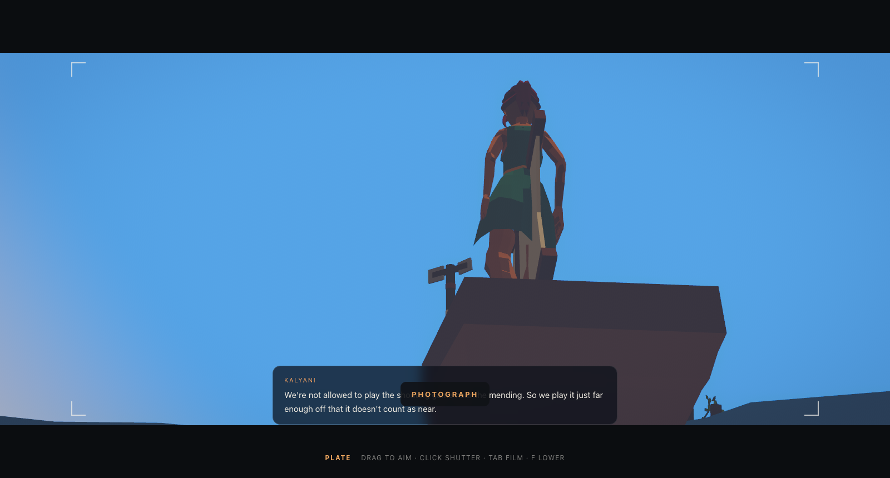
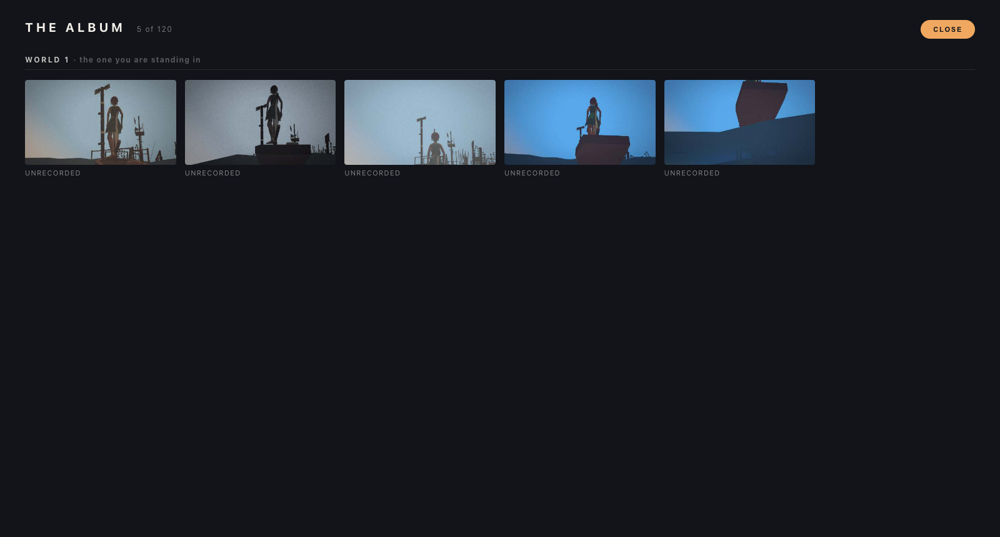

# Wonders — A Tiny Planet

An explorable planet built with [Three.js](https://threejs.org/) and [three-mesh-bvh](https://github.com/gkjohnson/three-mesh-bvh), inspired by [Messenger](https://messenger.abeto.co/) by Studio Abeto.

The sea has been rising for six generations. Walk a procedurally generated world, sail its oceans, meet the people still living on it, and piece together what happened — all toon-shaded, running in a browser tab.


*The world is fully built behind the title, so Begin drops you straight in — a white bloom covers the cut, then the camera descends onto your character.*


*Boardwalks, a salvage crane and a ladder tower at the waterline. Something is always coming over the horizon.*


*Press E to talk. Every line is written to its speaker's age, their settlement, and how much of the story you have uncovered.*


*Step onto water and you board a boat automatically.*


*Press F to raise a camera. Frame one of the seven wonders and it tells you what this world believes it was, against what your photograph actually shows.*


*The planet is procedural and unseeded, so every page load is a place that has never existed and will not exist again. The album outlives them, and says which worlds are gone.*

## Features

**Story**
- The world is drowning, and elevation tells the story: ruins at the waterline the sea already took, stilt houses where the stubborn still bail every day, and the living retreated uphill. The premise, tone and cast are in [docs/STORY.md](docs/STORY.md).
- 1,775 written lines of dialogue and 217 environmental lore entries, each tagged with a voice (child, teen, adult, elder), a settlement band, and a story stage.
- **Five stages of revelation, gated by exploration** rather than by talking. Stage 0 is weather and work with no mention of the flood; stage 4 is what people do with an ending. The story deepens because you went somewhere.
- Children have never seen the water lower, so to them the flood is not a tragedy — it is simply the world. Adults deflect grief into logistics. Elders reveal enormous things while complaining about something trivial.
- The seven wonders are all misremembered, each in a revealing way: Giza as deliberate flood markers, the Great Wall as a failed dam whose breach pilgrims still search for, the Colosseum as a cistern where lions drank.
- NPCs murmur ambient lines as you pass and give longer beats on `E`. Each remembers what they have already told you. Places can be examined too, and say more as the story unlocks.

**World**
- Procedurally generated planet of radius 75 — a continent mask gives coherent landmasses with real coastlines, ridged multifractal noise builds mountain ranges, terraced bands form mesas, and inverted-ridge channels carve valleys to the sea. About 39% land, peaks near 33 units, a new world every page load.
- **Dense, not empty.** Roughly 35 settlements and 1,000+ placed objects mean only ~4% of land has nothing in view, against 60% before the density pass. Median walk to the nearest structure is 14 units, well inside the ~23-unit horizon.
- Settlements are placed by elevation band — drowned ruins, stilt clusters and rafts, shore shanties, upland yurts and terraces, mountain camps, cave dwellings — each with its own kit from 28 hand-modelled structures.
- 42 tall landmarks (lighthouses, drowned towers, silos, cranes, spires) scattered *between* settlements, so something is always rising over the horizon. Boardwalks and docks radiate from waterline settlements; vines claim only the buildings people have given up on.
- **Caves, as secrets.** A heightfield planet cannot grow a cave - one radius per direction means no overhang and no roof - so up to seven hollow rock outcrops are seated on flat, dry, remote ground instead. From outside each reads as a boulder on a hillside; walk round it and there is a mouth. Placement avoids every settlement and monument, and no two are within 30 units of each other.
- Each cave holds a different trace of the people who came before: a hearth with a live fire, ochre handprints at the height of a walking adult, a calendar of squares cut into the rock, a stone cairn, seed stores, a toolmaker's rack, a sleeping camp. All seven are written against dialogue that was already in the corpus before any cave existed.
- Coastlines are deliberately walkable: a wide shallow shelf means you can wade ashore without jumping, while mountains stay dramatic and climbable on foot.
- Seven wonder monuments placed on a spherical Fibonacci lattice, with a site search that scores ground for flatness and dryness, and a level terrace carved under each so flat-based buildings seat flush.
- Toon shading throughout — a shared 4-band gradient map, vertex colours, inverted-hull outlines, and **no textures anywhere** (the whole scene uses 2).

**Life and atmosphere**
- 455 trees, 385 bushes and 32,200 grass tufts, scattered by sampling the real terrain mesh after terracing.
- Plant size is skewed, not uniform: grass runs cubed so the median tuft is ankle height and only a few percent grow tall, and trees and bushes are scaled to a target WORLD height rather than by a shared multiplier, so a variant that happens to be twice as tall in its own file does not become a blob twice the player's height.
- **Vegetation thins where people are.** Ground cover drops to ~17% of normal inside a settlement and ~53% around a monument, so nothing grows through walls and the approach to a wonder stays open — but never bare earth.
- Grass blades taper, lean and vary in height, are tinted per instance across five greens, and dry toward straw near the waterline where the salt reaches.
- Wind as a vertex-shader injection into the existing toon material: per-instance flutter plus a slow travelling gust envelope, so gusts roll across the field. Zero per-frame CPU cost.
- Ocean waves — a swell with chop and turbulence on top, tuned so crests wash clean over the stilt houses at the waterline and leave the shore towns dry. Water is clear enough overhead to read a drowned settlement through, and seals up toward the horizon so you cannot see across the planet.
- Day cycle: the sun arcs from early morning through midday to afternoon and loops, never dipping below the horizon, with light, sky and fog all keyed to sun elevation. Currently pinned to a high sun (`PINNED_PHASE` in `render/daylight.ts`).
- Post-processing in a single fullscreen pass: anime diffusion glow, ACES tone mapping, colour grading, vignette, dither and sRGB conversion.

**The camera, and the album**
- Raise a camera with `F` and photograph the world. Four film stocks — Plate, Salt, Ink, Ochre — applied as a filter, vignette and grain on the captured frame, so they cost nothing until the shutter fires.
- **Photographs outlive the world.** The planet is procedural and unseeded, so every page load builds a place that has never existed and will not exist again. The album is stamped with a world number and kept in IndexedDB, so it is the only thing in the game with continuity — and the gallery says so, labelling every past world *gone*.
- Photograph one of the seven wonders and it tells you what it is: 21 stage-gated entries pairing what this world *believes* the monument was against what your photograph actually shows. The same monument says more the second time, once you have seen more of the world.
- The frame is grabbed inside the same task as the draw call, because `preserveDrawingBuffer` is off in a production build and one frame later the canvas is already blank.

**Sound**
- **Two musical beds, chosen by where you are.** Among people it is public-domain Chopin nocturnes — solo piano, domestic, unmistakably played by a person. Alone, at sea, or high up it thins to a flat CC0 ambient bed with almost no events in it. Both run continuously and only the gains cross, so walking into a village fades rather than restarting a track. 18 minutes in 6.8MB.
- The ambient beds were chosen by measurement, not by title: all 101 tracks in the source collection were screened on short-window RMS steadiness and hard-onset count, and the two flattest kept. Lofi was tried first and rejected for having a beat — measured at 17 onsets per 90 seconds, against 1 and 2 for the beds that shipped.
- Music is streamed rather than decoded — a five-minute nocturne decodes to ~26MB of float samples, and holding the set would cost most of a hundred megabytes of RAM for background music.
- **The sea is synthesised, not sampled.** Filtered brown noise driven by the simulation: the surf swells with the actual wave passing under your feet (the same wave function the water shader uses), the body opens from distant rumble to audible foam as you approach the waterline, and wind rises with altitude and with how fast you are moving. No bytes on disk, no loop seam, and it reacts to things a recording cannot.
- Step inside a cave and the whole mix — music included — drops through a lowpass, because there is rock over your head.
- **NPCs murmur when they speak.** Not recordings and not words: a short run of soft blips pitched to the speaker's age — a child at 520Hz, an elder at 215 — with the length taken from the actual line and a downward drift so it lands like a sentence. It suits a game where every line is already written down; an approximate murmur under your own reading is closer to overhearing than a voice actor would be.
- Nothing is fetched until you press Begin, and the audio context is unlocked inside that click, which is the only gesture a browser guarantees.

**Movement**
- An unhurried walk (3.8) with an optional sprint (6.8). At the old 5.4 a lap of the 471-unit circumference took 87 seconds, which made a planet feel like a courtyard; it now takes just over two minutes. Walk and run clips play at the rate the character is actually travelling, so the feet stay planted.
- Tangent-plane movement on the sphere with gravity, jumping, slope limits and step-up, substepped at 20 ms so sprinting cannot tunnel through terrain during a frame hitch.
- Collision against the monuments' and buildings' real geometry — you can walk into the Colosseum and up Chichen Itza's steps, not bump an invisible box.
- Board a boat automatically on contact with water; it rides the actual wave surface rather than a flat sea.
- **Standing still means standing still.** The character keeps its facing when it stops, so the camera can be walked all the way round to their face. Previously an idle character faced the camera's forward vector, which meant orbiting swung them with it and their front was unreachable by construction.
- **The pointer does not steer the camera during play.** Walking does. The view holds a fixed pitch and eases in behind wherever you go, so it can never be dragged to the near-overhead shot that reads as a strategy game rather than as being there. Pointer look is a viewfinder privilege: raise the in-game camera with `F` and the drag aims freely, from just below level to a steep look-down, and walking will not pull your framing away while you compose.
- **Moving settles the view back over the shoulder**, slowly — the view eases in behind the direction of travel at about two seconds for a half-turn. The unhurried rate is the point: with no pointer look, walking back towards the camera is the only way to see the character's face, so the swing round behind them has to be a look rather than a flinch. Hold back and she turns and walks at you; let go and walk on and the shoulder shot returns.
- The body turns the whole way to face where it is going, with nothing capping it. A cap was tried, to stop a held strafe trailing the camera, and cost far more than it bought: back no longer turned her round, so she moonwalked, and it removed the last remaining way to see her face.
- The camera keeps clearance from the ground beneath wherever it lands, not just along the line back from the player — swinging round to the downhill side used to bury it 0.06 units above the terrain.
- Over-the-shoulder third-person camera that reorients to the local surface normal: close, near level, and slid sideways so the character sits low and off-centre and the frame is filled by what is ahead rather than by the ground underfoot.
- Minimap using an azimuthal projection, so the whole planet is always on screen and the antipode sits on the rim.

## Tech Stack

- [Vite](https://vitejs.dev/) — dev server & build tool
- [TypeScript](https://www.typescriptlang.org/) (strict)
- [Three.js](https://threejs.org/) — 3D rendering
- [three-mesh-bvh](https://github.com/gkjohnson/three-mesh-bvh) — accelerated raycasting for terrain and collision

Only two runtime dependencies. Everything else (glTF loading, geometry merging, surface sampling, post-processing) comes from `three/examples/jsm`.

## Performance

Around 537k triangles and 620 draw calls per frame, holding 120fps on an Apple M5 against a 60fps target. The rules that keep it there:

- **Chunked culling.** Flora is split into 260 spatial cells so per-object frustum culling discards the ~98% of the planet beyond the horizon. The cell must be small *relative to the view*: at 96 cells the median cell radius was 12.6 units against a ~23-unit visible cap, and flora alone drew 1.1M triangles. Tightening the cells cut total draw by 72%.
- **Instancing.** Trees and bushes are baked to a single geometry with material colours folded into vertex colours, so a whole two-tone tree is one instanced draw. One species per cell, which also reads as groves rather than evenly mixed forest.
- Wind, waves and the day cycle are shader/uniform work — no per-frame CPU loops over instances.
- Skinned NPCs only have their animation stepped within 45 units; skinning is the real cost, not the triangles.
- **The far plane is cut to just past the fog in play** (96 against the title screen's 800). This is not a micro-optimisation: fog is fully opaque at 90, but a far plane sized for the title screen let a downward-tilted frustum run straight through the planet and submit the entire far side of the world — invisible behind terrain, fully drawn. Measured at a downward tilt: 1,359 draws and 741k triangles, against 208 and 248k level. With it fixed, looking down is *cheaper* than looking level, as it should be. The sky dome rides the camera at radius 88 so it still fits inside that far plane.
- No shadow maps; the player's shadow is a blob decal.
- No textures. The entire scene uses 2 (a toon gradient ramp and the blob shadow), so there is essentially no texture memory.

A production build is **38.5 MB**: 28.8 MB of models, 6.8 MB of music, 1.7 MB of world dressing, and ~700 KB of code and assets. Gzip barely touches it — 37.6 MB over the wire — because almost all of it is glTF and MP3, which are already compressed. The code itself is 202 KB gzipped and the dialogue corpus 93 KB gzipped, so the bundle is not the problem and never will be: **the models are 75% of the build**, and the only lever that matters is decimating or Draco-compressing them.

(Measured as real bytes. `du` reports ~47 MB for the same directory because APFS allocates in blocks — worth knowing before optimising something that is already smaller than it looks.)

## Getting Started

### Prerequisites

- [Node.js](https://nodejs.org/) v18 or newer
- npm (bundled with Node.js)

### Installation

```bash
git clone https://github.com/Pritha1610/Small-Atlas.git
cd Small-Atlas
npm install
```

### Run the dev server

```bash
npm run dev
```

Open the local URL printed in your terminal (usually `http://localhost:5173`).

### Build for production

```bash
npm run build
npm run preview
```

The production build is emitted to `dist/`.

### Smoke test

```bash
npm run dev          # in one terminal
npm run smoke        # in another
```

Headless Playwright check: dismisses the title, waits out the intro, then verifies the app renders (a grid of sampled pixels is lit), the player moves, and no console errors occur.

Note that smoke runs under **software rendering** (`--use-angle=swiftshader`) for portability, so the `fps` it prints measures a CPU rasteriser and is *not* a performance signal. It is a boots / renders / moves / no-errors gate. Real performance is measured against a GPU separately.

## Project Structure

```
src/
  main.ts          # App entry: renderer, composer, scene, title/intro/play loop
  title.ts         # Opening screen, white bloom, descent handoff
  style.css        # Global styles, HUD, dialogue, title
  ui.ts            # HUD, minimap, wonder discovery
  photo.ts         # In-game camera, film stocks, IndexedDB album
  audio.ts         # Music, and synthesised sea / wind / cave muffle
  player/
    input.ts       # Keyboard/pointer input
    controller.ts  # Spherical movement, gravity, ground & wall collision
    player.ts      # Character model, animation, swappable skins
    camera.ts      # Third-person camera rig
  render/
    sky.ts         # Sky dome shader
    toon.ts        # Shared toon gradient map + outline helper
    blobShadow.ts  # Soft blob shadow under the player
    wind.ts        # Vertex-shader wind injection
    grade.ts       # Post-processing: glow, tone map, colour grade, vignette
    daylight.ts    # Day cycle: sun arc, light and sky palette
  story/
    dialogue.ts    # Corpus loading, line selection, story stages
    interaction.ts # Proximity prompts, dialogue panel, ambient murmurs
  world/
    noise.ts       # Value noise, fbm, ridged multifractal
    planet.ts      # Terrain generation, colouring, terrace carving
    props.ts       # Instanced flora, chunked culling, clearings
    caves.ts       # Hollow rock outcrops, their contents and their collision
    dressing.ts    # Props, connectors, vines, vertical landmarks
    water.ts       # Ocean waves and depth-aware clarity
    assets.ts      # glTF loading, caching, toon material conversion
    wonders.ts     # Monument loading, placement, collision
    settlements.ts # Settlements, residents, speakers, landmarks
    boat.ts        # Boat model
scripts/
  smoke.mjs        # Headless smoke test
docs/
  STORY.md         # The story bible the dialogue is written against
plans.md           # Design for the favours (quest) system, not yet built
public/
  models/          # Wonders, characters, NPCs, structures, verticals, flora, camp props
  props/ connectors/ vines/    # World dressing
  story/corpus.json            # 1,775 dialogue lines + 217 lore entries
  audio/                       # Two piano + two ambient beds (everything else is synthesised)
```

## Controls

| Input | Action |
| --- | --- |
| `W` / `A` / `S` / `D` | Move |
| `Shift` | Run |
| `Space` | Jump |
| `E` | Talk to someone, or examine a place |
| `C` | Swap character model |
| `F` | Raise / lower the camera — drag aims, click shoots, `Tab` changes film |
| `G` | Open the album |
| `M` | Sound on / off |

Walk into water and you board the boat automatically; step back onto land and you leave it.

## Tuning

Most of the feel lives in a few named constants:

| Constant | File | Controls |
| --- | --- | --- |
| `PLANET_RADIUS`, `WATER_Y` | `world/planet.ts` | World size and sea level |
| `MTN_AMP`, `MTN_FREQ`, `SHELF`, `PLAIN_H` | `world/planet.ts` | Mountain drama and how walkable the coast is |
| `SWELL`, `CHOP`, `TURB` | `world/water.ts` | Sea roughness |
| `NEAR_ALPHA`, `OPAQUE_AT`, `CLEAR_TO` | `world/water.ts` | How far you can see into the water |
| `TREE_COUNT`, `BUSH_COUNT`, `GRASS_COUNT`, `CHUNKS` | `world/props.ts` | Foliage density and culling granularity |
| `SETTLEMENT_SLOTS`, `MAX_RESIDENTS`, `ANIM_RANGE` | `world/settlements.ts` | How populated the world feels |
| `PINNED_PHASE`, `DAY_SECONDS` | `render/daylight.ts` | Pin the sun, or run the day cycle |
| `GRADE`, `GLOW`, `VIGNETTE`, `DITHER` | `render/grade.ts` | Post-processing look |
| `WALK`, `RUN`, `JUMP`, `GRAVITY` | `player/controller.ts` | Movement feel |
| `VOICES`, `VOICE_GAIN` | `audio.ts` | Pitch and cadence of each age's murmur |
| `DIST`, `LOOK_HEIGHT`, `SHOULDER` | `player/camera.ts` | How close and how over-the-shoulder the camera sits |
| `RECENTRE_RATE`, `PLAY_PITCH` | `player/camera.ts` | How fast the view settles behind you, and the angle it holds |
| `PITCH_MIN`, `PITCH_MAX` | `player/camera.ts` | How far up and down the view tilts |
| `FAR_PLAY`, `FAR_TITLE` | `main.ts` | View distance in play vs on the title screen |
| `FILMS`, `MAX_PHOTOS` | `photo.ts` | Film stocks and album size |
| `BEDS`, `MUSIC_GAIN`, `SEA_EARSHOT` | `audio.ts` | Which music plays where, and how loud the sea is |

## Credits

- Music: Chopin nocturnes performed by Luke Faulkner and Xuan He — **public domain recordings** via [Wikimedia Commons](https://commons.wikimedia.org/wiki/Category:Nocturnes_(Chopin)); ambient beds from **[John Bartmann's Straylight Drones Collection](https://freemusicarchive.org/music/John_Bartmann/100-ambient-atmospheric-soundtracks-straylight-drones-collection)** — CC0 1.0, no attribution required. See `public/audio/LICENSE.txt`.
- Model licences and sources are recorded next to the assets themselves, in `LICENSE.txt` under each of `public/models/`, `public/models/camp/`, `public/models/flora/` and `public/models/special/`. Those files ship with the build.

## License

No license specified. All rights reserved.
