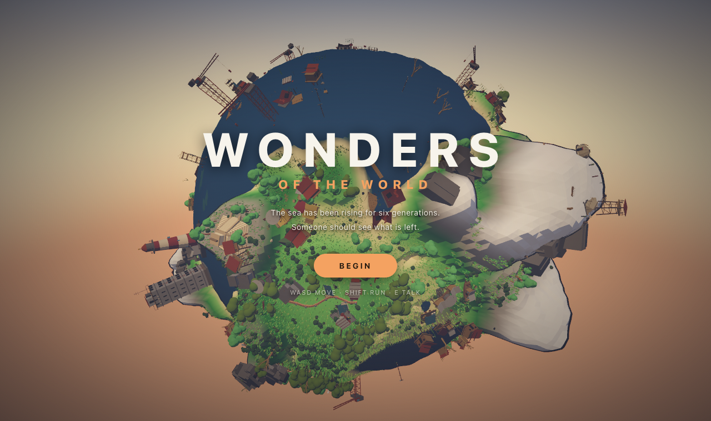

# Wonders — A Tiny Planet

An explorable planet built with [Three.js](https://threejs.org/) and [three-mesh-bvh](https://github.com/gkjohnson/three-mesh-bvh), inspired by [Messenger](https://messenger.abeto.co/) by Studio Abeto.

The sea has been rising for six generations. Walk a procedurally generated world, sail its oceans, meet the people still living on it, and piece together what happened — all toon-shaded, running in a browser tab.


*The world is fully built behind the title, so Begin drops you straight in — a white bloom covers the cut, then the camera descends onto your character.*


*Boardwalks, a salvage crane and a ladder tower at the waterline. Something is always coming over the horizon.*


*Press E to talk. Every line is written to its speaker's age, their settlement, and how much of the story you have uncovered.*


*Step onto water and you board a boat automatically.*

## Features

**Story**
- The world is drowning, and elevation tells the story: ruins at the waterline the sea already took, stilt houses where the stubborn still bail every day, and the living retreated uphill. The premise, tone and cast are in [docs/STORY.md](docs/STORY.md).
- ~2,000 written lines of dialogue and environmental lore, each tagged with a voice (child, teen, adult, elder), a settlement band, and a story stage.
- **Five stages of revelation, gated by exploration** rather than by talking. Stage 0 is weather and work with no mention of the flood; stage 4 is what people do with an ending. The story deepens because you went somewhere.
- Children have never seen the water lower, so to them the flood is not a tragedy — it is simply the world. Adults deflect grief into logistics. Elders reveal enormous things while complaining about something trivial.
- The seven wonders are all misremembered, each in a revealing way: Giza as deliberate flood markers, the Great Wall as a failed dam whose breach pilgrims still search for, the Colosseum as a cistern where lions drank.
- NPCs murmur ambient lines as you pass and give longer beats on `E`. Each remembers what they have already told you. Places can be examined too, and say more as the story unlocks.

**World**
- Procedurally generated planet of radius 75 — a continent mask gives coherent landmasses with real coastlines, ridged multifractal noise builds mountain ranges, terraced bands form mesas, and inverted-ridge channels carve valleys to the sea. About 39% land, peaks near 33 units, a new world every page load.
- **Dense, not empty.** Roughly 35 settlements and 1,000+ placed objects mean only ~4% of land has nothing in view, against 60% before the density pass. Median walk to the nearest structure is 14 units, well inside the ~23-unit horizon.
- Settlements are placed by elevation band — drowned ruins, stilt clusters and rafts, shore shanties, upland yurts and terraces, mountain camps, cave dwellings — each with its own kit from 28 hand-modelled structures.
- 42 tall landmarks (lighthouses, drowned towers, silos, cranes, spires) scattered *between* settlements, so something is always rising over the horizon. Boardwalks and docks radiate from waterline settlements; vines claim only the buildings people have given up on.
- Coastlines are deliberately walkable: a wide shallow shelf means you can wade ashore without jumping, while mountains stay dramatic and climbable on foot.
- Seven wonder monuments placed on a spherical Fibonacci lattice, with a site search that scores ground for flatness and dryness, and a level terrace carved under each so flat-based buildings seat flush.
- Toon shading throughout — a shared 4-band gradient map, vertex colours, inverted-hull outlines, and **no textures anywhere** (the whole scene uses 2).

**Life and atmosphere**
- 650 trees, 550 bushes and 46,000 grass tufts, scattered by sampling the real terrain mesh after terracing.
- **Vegetation thins where people are.** Ground cover drops to ~17% of normal inside a settlement and ~53% around a monument, so nothing grows through walls and the approach to a wonder stays open — but never bare earth.
- Grass blades taper, lean and vary in height, are tinted per instance across five greens, and dry toward straw near the waterline where the salt reaches.
- Wind as a vertex-shader injection into the existing toon material: per-instance flutter plus a slow travelling gust envelope, so gusts roll across the field. Zero per-frame CPU cost.
- Ocean waves — a swell with chop and turbulence on top, tuned so crests wash clean over the stilt houses at the waterline and leave the shore towns dry. Water is clear enough overhead to read a drowned settlement through, and seals up toward the horizon so you cannot see across the planet.
- Day cycle: the sun arcs from early morning through midday to afternoon and loops, never dipping below the horizon, with light, sky and fog all keyed to sun elevation. Currently pinned to a high sun (`PINNED_PHASE` in `render/daylight.ts`).
- Post-processing in a single fullscreen pass: anime diffusion glow, ACES tone mapping, colour grading, vignette, dither and sRGB conversion.

**Movement**
- Tangent-plane movement on the sphere with gravity, jumping, slope limits and step-up, substepped at 20 ms so sprinting cannot tunnel through terrain during a frame hitch.
- Collision against the monuments' and buildings' real geometry — you can walk into the Colosseum and up Chichen Itza's steps, not bump an invisible box.
- Board a boat automatically on contact with water; it rides the actual wave surface rather than a flat sea.
- Third-person orbit camera that reorients to the local surface normal.
- Minimap using an azimuthal projection, so the whole planet is always on screen and the antipode sits on the rim.

## Tech Stack

- [Vite](https://vitejs.dev/) — dev server & build tool
- [TypeScript](https://www.typescriptlang.org/) (strict)
- [Three.js](https://threejs.org/) — 3D rendering
- [three-mesh-bvh](https://github.com/gkjohnson/three-mesh-bvh) — accelerated raycasting for terrain and collision

Only two runtime dependencies. Everything else (glTF loading, geometry merging, surface sampling, post-processing) comes from `three/examples/jsm`.

## Performance

Roughly 450k triangles drawn, holding 120fps on an Apple M5 against a 60fps target. The rules that keep it there:

- **Chunked culling.** Flora is split into 260 spatial cells so per-object frustum culling discards the ~98% of the planet beyond the horizon. The cell must be small *relative to the view*: at 96 cells the median cell radius was 12.6 units against a ~23-unit visible cap, and flora alone drew 1.1M triangles. Tightening the cells cut total draw by 72%.
- **Instancing.** Trees and bushes are baked to a single geometry with material colours folded into vertex colours, so a whole two-tone tree is one instanced draw. One species per cell, which also reads as groves rather than evenly mixed forest.
- Wind, waves and the day cycle are shader/uniform work — no per-frame CPU loops over instances.
- Skinned NPCs only have their animation stepped within 45 units; skinning is the real cost, not the triangles.
- No shadow maps; the player's shadow is a blob decal.
- No textures. The entire scene uses 2 (a toon gradient ramp and the blob shadow), so there is essentially no texture memory.

A production build is ~28 MB on disk, dominated by the character and NPC models; the code itself is ~197 KB gzipped. The dialogue corpus is 355 KB of JSON, loaded separately from the bundle.

## Getting Started

### Prerequisites

- [Node.js](https://nodejs.org/) v18 or newer
- npm (bundled with Node.js)

### Installation

```bash
git clone https://github.com/Pritha1610/Small-Atlas.git
cd Small-Atlas
npm install
```

### Run the dev server

```bash
npm run dev
```

Open the local URL printed in your terminal (usually `http://localhost:5173`).

### Build for production

```bash
npm run build
npm run preview
```

The production build is emitted to `dist/`.

### Smoke test

```bash
npm run dev          # in one terminal
npm run smoke        # in another
```

Headless Playwright check: dismisses the title, waits out the intro, then verifies the app renders (a grid of sampled pixels is lit), the player moves, and no console errors occur.

Note that smoke runs under **software rendering** (`--use-angle=swiftshader`) for portability, so the `fps` it prints measures a CPU rasteriser and is *not* a performance signal. It is a boots / renders / moves / no-errors gate. Real performance is measured against a GPU separately.

## Project Structure

```
src/
  main.ts          # App entry: renderer, composer, scene, title/intro/play loop
  title.ts         # Opening screen, white bloom, descent handoff
  style.css        # Global styles, HUD, dialogue, title
  ui.ts            # HUD, minimap, wonder discovery
  player/
    input.ts       # Keyboard/pointer input
    controller.ts  # Spherical movement, gravity, ground & wall collision
    player.ts      # Character model, animation, swappable skins
    camera.ts      # Third-person camera rig
  render/
    sky.ts         # Sky dome shader
    toon.ts        # Shared toon gradient map + outline helper
    blobShadow.ts  # Soft blob shadow under the player
    wind.ts        # Vertex-shader wind injection
    grade.ts       # Post-processing: glow, tone map, colour grade, vignette
    daylight.ts    # Day cycle: sun arc, light and sky palette
  story/
    dialogue.ts    # Corpus loading, line selection, story stages
    interaction.ts # Proximity prompts, dialogue panel, ambient murmurs
  world/
    noise.ts       # Value noise, fbm, ridged multifractal
    planet.ts      # Terrain generation, colouring, terrace carving
    props.ts       # Instanced flora, chunked culling, clearings
    dressing.ts    # Props, connectors, vines, vertical landmarks
    water.ts       # Ocean waves and depth-aware clarity
    assets.ts      # glTF loading, caching, toon material conversion
    wonders.ts     # Monument loading, placement, collision
    settlements.ts # Settlements, residents, speakers, landmarks
    boat.ts        # Boat model
scripts/
  smoke.mjs        # Headless smoke test
docs/
  STORY.md         # The story bible the dialogue is written against
plans.md           # Design for the favours (quest) system, not yet built
public/
  models/          # Wonders, characters, NPCs, structures, verticals, flora
  props/ connectors/ vines/    # World dressing
  story/corpus.json            # ~2,000 dialogue lines and environmental lore
```

## Controls

| Input | Action |
| --- | --- |
| `W` / `A` / `S` / `D` | Move |
| Mouse / pointer drag | Look around |
| `Shift` | Run |
| `Space` | Jump |
| `E` | Talk to someone, or examine a place |
| `C` | Swap character model |

Walk into water and you board the boat automatically; step back onto land and you leave it.

## Tuning

Most of the feel lives in a few named constants:

| Constant | File | Controls |
| --- | --- | --- |
| `PLANET_RADIUS`, `WATER_Y` | `world/planet.ts` | World size and sea level |
| `MTN_AMP`, `MTN_FREQ`, `SHELF`, `PLAIN_H` | `world/planet.ts` | Mountain drama and how walkable the coast is |
| `SWELL`, `CHOP`, `TURB` | `world/water.ts` | Sea roughness |
| `NEAR_ALPHA`, `OPAQUE_AT`, `CLEAR_TO` | `world/water.ts` | How far you can see into the water |
| `TREE_COUNT`, `BUSH_COUNT`, `GRASS_COUNT`, `CHUNKS` | `world/props.ts` | Foliage density and culling granularity |
| `SETTLEMENT_SLOTS`, `MAX_RESIDENTS`, `ANIM_RANGE` | `world/settlements.ts` | How populated the world feels |
| `PINNED_PHASE`, `DAY_SECONDS` | `render/daylight.ts` | Pin the sun, or run the day cycle |
| `GRADE`, `GLOW`, `VIGNETTE`, `DITHER` | `render/grade.ts` | Post-processing look |
| `WALK`, `RUN`, `JUMP`, `GRAVITY` | `player/controller.ts` | Movement feel |

## Credits

- Flora (trees, bushes) and the boat by [Quaternius](https://quaternius.com) — CC0 1.0 public domain, via [Poly Pizza](https://poly.pizza). Chosen because they are untextured and low-poly, so they match the flat-shaded look and cost no texture memory. See `public/models/flora/LICENSE.txt`.
- Wonder monuments, settlement structures, world dressing and all character/NPC models authored in Blender.

## License

No license specified. All rights reserved.
